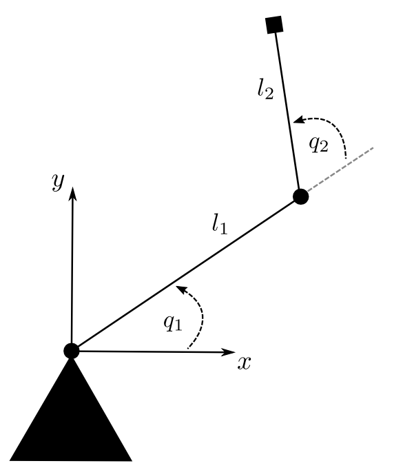
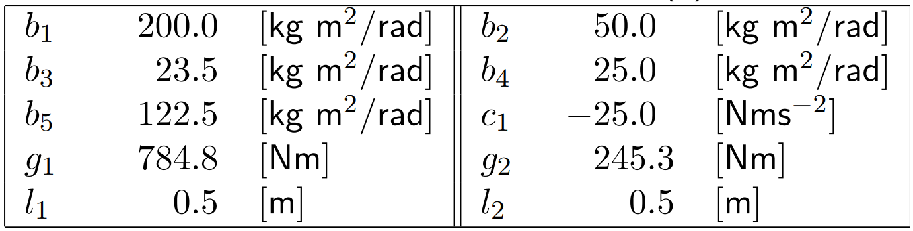
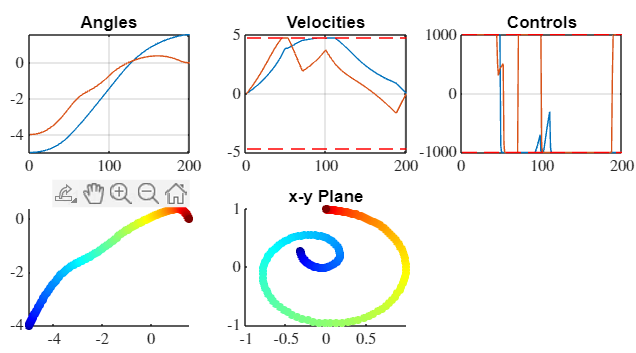
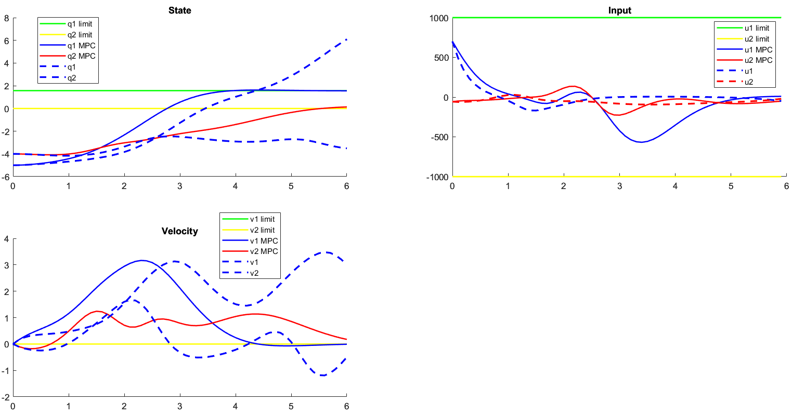
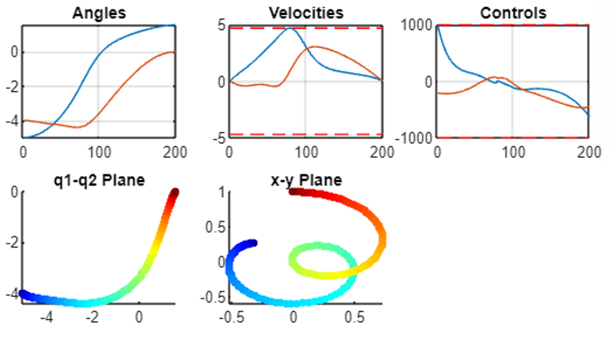
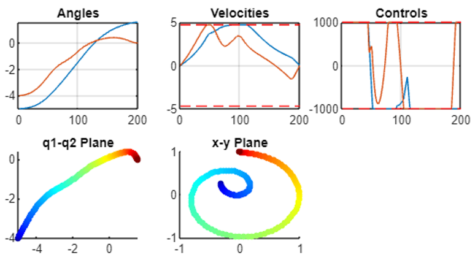
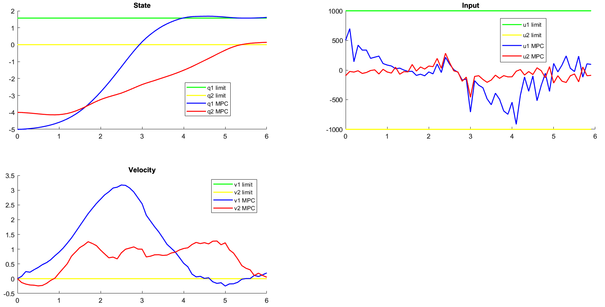

# Rest-to-Rest-control-of-a-2-DoF-Robot
Rest-to-Rest control of a 2-DoF Robot using NMPC Controller implemented using CasADi in Matlab

# a) Goal of the Project

An often occurring control task in industry is to compute optimal input trajectories for robots to reach a given end position while consuming minimal energy, or to reach the end position in minimal time. In this project we want to tackle these challenges by controlling a two-degree-of-freedom (2-DoF) robot shown in Figure 1. The dynamic model
of the robot is given by a vector-valued second order differential equation.

$$\begin{aligned}
B(q)\ddot{q} + C(q, \dot{q})\dot{q} + g(q) &= u
\end{aligned}$$

in terms of the joint angles $q = \begin{pmatrix} q_1 \\ q_2 \end{pmatrix} \in \mathbb{R}^2$ and the input torques $u = \begin{pmatrix} u_1 \\ u_2 \end{pmatrix}\in \mathbb{R}^2$ .The coefficient matrices are given by:

$$B(q) = \begin{pmatrix} b_1 + b_2 \cos(q_2) & b_3 + b_4 \cos(q_2) \\ b_3 + b_4 \cos(q_2) & b_5 \end{pmatrix} \in \mathbb{R}^{2x2},$$

$$C(q, \dot{q}) = -c_1 \sin(q_2)\begin{pmatrix} \dot{q}_2 & \dot{q}_1 + \dot{q}_2 \\-\dot{q}_1 & 0\end{pmatrix} \in \mathbb{R}^{2x2},$$

$$g(q) = \begin{pmatrix}g_1 \cos(q_1) + g_2 \cos(q_1 + q_2) \\g_2 \cos(q_1 + q_2)\end{pmatrix}\in \mathbb{R}^{1x2}.$$

$$q = \begin{pmatrix}
q_1 \\
q_2
\end{pmatrix}, \quad
u = \begin{pmatrix}
u_1 \\
u_2
\end{pmatrix}$$

*Figure 1: 2-DoF robot.*

*Figure 2: Parameters for system (1).*

# b) Modeling

### 1) Obtaining model (1) from physical laws and formulating the model in q1-q2-coordinates and not in x-y-coordinates:

The dynamic model of a 2-DOF robotic arm is a set of mathematical equations describing the relationship between its motion, the forces acting on it, and the torques applied to its joints. It's essentially a way to predict how the arm will behave under different conditions. There are different ways to derive the dynamic model, but the most common methods involve:

**Lagrangian dynamics:** This approach uses the principle of Lagrange's equations to relate the kinetic and potential energies of the system to the applied torques. It results in a set of second-order, nonlinear differential equations.
$$L(\mathbf{q},\mathbf {\dot{q}})=T(\mathbf{q},\mathbf{\dot{q}})-U(\mathbf{q})$$

**Euler-Lagrange equations:** This is a simplified version of the Lagrangian approach and leads to the same set of differential equations. 
$$\frac{d}{dt}\left(\frac{\partial}{\partial \dot{q}} L(q, \dot{q})\right)^T-\left(\frac{\partial}{\partial q} L(q, \dot{q})\right)^T=\xi$$

The dynamic model is often formulated in joint space (q1, q2) rather than Cartesian space (x, y) because it simplifies the representation of the system dynamics. In joint space, the dynamics are typically described by a set of coupled second-order differential equations, making it more straightforward to analyze and control the robot's
behavior.

Additionally, the joint space naturally reflects the actuator inputs (joint torques or forces), making it more suitable for control purposes. The transformation between joint space and Cartesian space can be achieved through the robot's forward and inverse kinematics.

### 2) Model (1) is given as an implicit system of second-order differential equations. Reformulating it as an explicit first-order system in state space form $\dot{x} = f(x,u)$:

To reformulate the implicit second-order differential equation system $\ddot{q} = f(q, \dot{q}, u)$ as an explicit first-order system in state space form $\dot{x} = f(x, u)$, we need to introduce a state vector $x$ and rewrite the system as a set of first-order differential equations.

First we define the state vector $Y$ as follows:

$$assuming: x_1 = q_1, x_2 = \dot{q_1}, x_3 = q_2, x_4 = \dot{q_2}$$
$$X  = \begin{pmatrix} x_1 \\ x_2 \\ x_3 \\ x_4 \end{pmatrix}$$
$$Y  = \begin{pmatrix} \dot{x_1} \\ \dot{x_2} \\ \dot{x_3} \\ \dot{x_4} \end{pmatrix} = \begin{pmatrix} x_2 \\ \dot{x_2} \\ x_4 \\ \dot{x_4} \end{pmatrix} = \begin{pmatrix} \dot{q_1} \\ \ddot{q}_1 \\ \dot{q_2} \\ \ddot{q}_2 \end{pmatrix}$$

We notice that the equation involves the two joint angles $q_1$ and $q_2$ along with their derivatives, while the input $u$ consists of only the two input torques $u_1$ and $u_2$. However, the $X$ vector has four components. Hence, we need to adjust the equation (1) matrices to be $4 \times 4$ instead of $2 \times 2$.

The modified forms will be as follows:

$$B = \begin{bmatrix}
1 & 0 & 0 & 0 \\
0 & b_1 + b_2 \cos(x_3) & 0 & b_3 + b_4 \cos(x_3) \\
0 & 0 & 1 & 0 \\
0 & b_3 + b_4 \cos(x_3) & 0 & b_5
\end{bmatrix}  \in \mathbb{R}^{4 \times 4}$$

$$C = -c_1 \sin(x_3) \begin{bmatrix}
0 & \frac{1}{c_1 \sin(x_3)} & 0 & 0 \\
0 & x_4 & 0 & x_2 + x_4 \\
0 & 0 & 0 & \frac{1}{c_1 \sin(x_3)} \\
0 & -x_2 & 0 & 0
\end{bmatrix} \in \mathbb{R}^{4 \times 4}$$

$$G = \begin{bmatrix}
0 \\
g_1 \cos(x_1) + g_2 \cos(x_1 + x_3) \\
0 \\
g_2 \cos(x_1 + x_3)
\end{bmatrix} \in \mathbb{R}^{4 \times 1}$$\
The $U$ vector should be expanded to become appropriate to the other matrices:
$$U = \begin{bmatrix}0 \\u_1 \\0 \\u_2\end{bmatrix} \in \mathbb{R}^{4 \times 1}$$\
The new equation structure: $$eqn=B*Y+C*X+G==U$$ where the $X$ vector would be: $$X = \left[ \begin{array}{c}
x_1 \\
x_2 \\
x_3 \\
x_4\end{array} \right]$$ Next we solve symbolically the equation in terms of $Y$ using Matlab command `solve(eqn, Y)` which results the value of $\dot{x_2}$ or $\ddot{q1}$ and $\dot{x_4}$ or $\ddot{q2}$. Subsequently, we get the $Y$ values so that we have the final state space vector of our dynamical 2D Planar Arm model to use later in the OCP to calculate the next states of the system:
$$Y   = \begin{pmatrix} \dot{x_1} \\ \dot{x_2} \\ \dot{x_3} \\ \dot{x_4} \end{pmatrix} = \begin{pmatrix} x_2 \\ \dot{x_2} \\ x_4 \\ \dot{x_4} \end{pmatrix} = = \left[ \begin{array}{c}
x_2 \\
\text{solution of }\dot{x}_2 \\
x_4 \\
\text{solution of } \dot{x}_4
\end{array} \right]$$\
So in short, the appropriate state vector $x$ will be the $X$ vector, and the form $\dot{x}=f(x,u)$ will be the equation $eqn=B*Y+C*X+G==U$ solved in terms of the vector $Y$ which is the vector for the $\dot{x}$.

# C) Open-loop Optimal Control:

### 1) Formulating different OCPs that drive the robot from the initial position $q = ({-5}, {-4})^\top$ rad, $\dot{q} = (0, 0)^\top$ rad/s to the upper position $q = (\frac{\pi}{2}, 0)^\top$rad, $\dot{q} = (0, 0)^\top$ rad/s in $3$ s. Thereby, the input constraints $u \in [{-1000}, {1000}]$ Nm and the state constraints $\dot{q} \in [-\frac{3}{2}\pi, \frac{3}{2}\pi]$ rad/s should be satisfied for all times. 

- OCP1: Quadratic Cost Function of inputs and state error: 

The optimal control problem (OCP) can be formulated as follows: $$\begin{aligned}
&\underset{u(.)}{\text{Minimize}} \quad \int_{t(1)}^{t(2)} [x(t) - x_{\text{end}}]^T Q [q(t)-q_{\text{end}}] + u(t)^T R u(t) \, dt \\
&\text{subject to} \\
&\quad 
\begin{aligned}[t] 
&\dot{x} = f(x, u), \quad x(0) = \begin{bmatrix}-5 \\ 0 \\ -4 \\ 0\end{bmatrix}, \\
&x_{1,3}(t) \in [-6, 6], \quad x_{2,4}(t) \in \left[-\frac{3\pi}{2}, \frac{3\pi}{2}\right], \quad u(t) \in [-1000, 1000] \quad \text{for } t \in [0, 3]
\end{aligned}
\end{aligned}$$ The Q and R are cost matrices which are:
$$Q=1e^2diag(\begin{bmatrix}1&1& 1& 1\end{bmatrix})  \quad\quad\quad\quad\quad R=1e^{-2}diag(\begin{bmatrix}3&1\end{bmatrix})$$

A terminal constraint could be added also as:
$$x(t(2))= \begin{bmatrix}\pi/2 \\ 0 \\ 0 \\ 0\end{bmatrix}$$

- OCP2: Quadratic Cost Function of inputs only: 

The optimal control problem (OCP) can be formulated as follows: $$\begin{aligned}
&\underset{u(.)}{\text{Minimize}} \quad \int_{t(1)}^{t(2)} u(t)^T R u(t) \, dt \\
\end{aligned}$$ and all other constraints and values stays the same.

- OCP3: Minimum Time 

$$\begin{aligned}
&\underset{u(.), T}{\text{Minimize}} \quad \int_{0}^{T} 1 dt = \underset{u(.), T}{\text{Minimize}} \quad T\\
&\text{subject to} \\
&\quad 
\begin{aligned}[t] 
& \text{we also have same constraints but with} & T > 0
\end{aligned}
\end{aligned}$$\
OCP4: Minimum Time + quadratic input cost $$\begin{aligned}
&\underset{u(.), T}{\text{Minimize}} \quad \int_{t(1)}^{t(2)} u(t)^T R u(t) + T\\
&\text{subject to} \\
&\quad 
\begin{aligned}[t] 
& \text{we also have same constraints but with} & T > 0
\end{aligned}
\end{aligned}$$

## d) Numerical Solution:

Sampling time of 0.05, 0.1, 0.5 were used along with 3 different integrators: rk4, heun and euler forward. The results from using different was not much different but sampling time affected more the outputs.

|           | eulerf | heun  | rk4  |
|-----------|--------|-------|------|
| Calculation Time [s] | 0.337  | 0.796 | 1.72 |
| Num of Iterations     | 49     | 42    | 43   |

*Table 1: Different Integrators using a sampling time of 0.1 sec*

{#fig:integrators width="110%"}
*Figure 3: Simulation Graphs using different integrators*

The results are very similar but we can notice the difference in the calcualation time where euler forward method is much faster the rk4.

#### 1) Diff Sampling Times:

|  Sampling Times [s]  | 0.05 | 0.1  |  0.5  |
|:----------------------:|:----:|:----:|:-----:|
| Calculation Time [s] | 12.6 | 1.74 | 0.163 |
|   Num of Iterations    |  56  |  43  |  16   |

*Table2: Different sampling times using rk4*

We can notice that the graphs for sampling times of 0.05 and 0.1 are very similar. Also, both are better than the 0.5 sampling time. But the catch is in the time needed to calculate the optimal solution as a sampling time of 0.05 is 12.6 sec which is x7 longer than a sampling time of 0.1 . Thus, maybe the resolution is much better with 0.05 but not needed in our case.

*Figure 4: Simulation Graphs using different sampling time*

### 2) Formulating a problem that reaches the end position from a) in minimum time:

The OCP used is OCP3 formulated in part a). The **min time** found is: **2.3631** sec

{#fig:enter-label width="50%"}
*Figure 5: Min Time Graphs*

We can notice that the output is similar to bang bang control which makes sense so that we can find the minimum time to reach the optimal solution.

The compromised OCP is the OCP4 found also in part a). Below some tests were done to find a compromise between both costs:

|       Compromise       | 1000T+J | 100000T+J | 10000000T + J |
|:----------------------:|:-------:|:---------:|:-------------:|
|     Min Time [s]     | 7.2553  |  3.5432   |    2.3656     |
| Calculation Time [s] |  30.43  |   46.83   |     50.50     |
|   Num of Iterations    |   92    |    144    |      157      |
|       Figure num       |    6    |     7     |       8       |

*Table3: Compromise between time and input cost*

{#fig:enter-img1 width="60%"}
*Figure 6: 1000T+J*

{#fig:enter-img2 width="60%"}
*Figure 7: 100000T+J*

{#fig:enter-img3 width="60%"}
*Figure 8: 10000000T+J*

# e) Model Predictive Control

### 1) Possible type of uncertainties/disturbances that could affect the robot:

a.  **Friction**: Friction in the joints can cause unpredictable resistance to the robot's motion like Viscous friction torque and Static friction torque.

-   **Viscous friction torque**: The frictional torque $-F_v$ can be modeled as a function of joint velocity $\dot{q}$:
$B(q)\ddot{q} + C(q, \dot{q})\dot{q} + g(q) = u - F_v \dot{q}$

-   **Static friction torque**: The frictional torque $-F_c$ can be modeled as a function of joint velocity $\dot{q}$:
$B(q)\ddot{q} + C(q, \dot{q})\dot{q} + g(q) = u - F_c sgn(\dot{q})$

b.  **External Forces**: Forces applied by the environment or objects can perturb the robot's motion.

-   **Mathematical Formulation**: External forces acting on the robot can be represented as a vector function of joint velocity $J^T(q) h_e$:
    $B(q)\ddot{q} + C(q, \dot{q})\dot{q} + g(q) = u - J^T(q) h_e$

c.  **Sensor Noise**: Noise in sensor measurements can introduce uncertainty in the feedback signals.

-   **Mathematical Formulation**: Sensor measurements $y$ may be corrupted by additive noise $n$:
    $y_{\text{noisy}} = y_{\text{true}} + n$.

d.  **Modeling Errors**: Simplifications or inaccuracies in the mathematical model used for control can lead to discrepancies between the model and the actual system.

-   **Mathematical Formulation**: Model parameters or dynamics may deviate from the true system dynamics:
    $\text{Model}(q, \dot{q}, u) \neq \text{Actual}(q, \dot{q}, u)$.

### 2) Design an MPC controller for the fixed end-time problem a) from the previous exercise.

Model Predictive Control (MPC) is a control strategy used in dynamical systems to optimize future behavior based on a predictive model. It operates by repeatedly solving an optimization problem over a finite time horizon, considering the current state of the system and predicting its future evolution. MPC takes into account system dynamics,
constraints on inputs and states, and possibly disturbances or uncertainties to compute optimal control actions. By iteratively updating the control policy, MPC can adapt to changes in the system and external conditions, making it suitable for a wide range of applications including robotics, process control, and automotive systems.

For the MPC controller, we use the same OCP as before but this time we input only the first optimal input to the system:
$$\begin{aligned}
u^*(\tau|t_k) \text{  for  } \tau \in [t_k, t_{k+1})
\end{aligned}$$

### 3) Assume incorrect parameters in the model, such as $b1 = 180\ kg\ m^2/rad$ and $b2 = 45 \ kg\ m^2/rad$. When/how would this happen in practice? Simulate the open loop and the closed loop system. Plot your results and describe the differences.

One common scenario is when the physical properties of the system are not accurately known or change over time due to wear and tear. For example, if the inertia of the robot's joints is incorrectly estimated, it can lead to discrepancies between the predicted and actual behavior of the system. Below is a graph comparing between the original and
mismatched models. Only the Joint graph is shown for clearer results. The OCP is solved assuming we have correct parameters and then applied on both the original or mismatched systems. The difference is clearly shown as there is no feedback.

{#fig:enter-label width="40%"}
*Figure 9: Comparing between the original and mismatched dynamics behaviour using optimal input*

{#fig:enter-label width="100%"}
*Figure 10: Comparison between Open and Closed Loop when model is mismatched*

### 4) Now assume an additive Gaussian measurement error; choose a meaningful value for the variance. Implement this situation and simulate your closed-loop system for the fixed end-time problem. What do you observe? Plot your results.

Variance is implemented using the below formula and is added to the initial condition of the input X variable at the start of the MPC loop so that it represent error in the measurement:
$$\text{measurement\_noise\_variance} = 0.01 \\
\\
X0 = x(:,k) + \sqrt{\text{measurement\_noise\_variance}} \times \text{randn}(\text{size}(x(:, k)))$$

{#fig:enter-label width="100%"}
*Figure 11: MPC with Gaussian Noise*

### 5) Analyze the stability properties of your designed MPC controller.

Analyzing the stability properties of the MPC controller involvesexamining how well it performs under various conditions, includingdisturbances, noise, and model inaccuracies. From Figures 11 and 12, it's evident that the MPC model demonstrates good performance, effectively driving the system towards the optimal values despite potential challenges. Moreover, the length of the horizon in MPC significantly influences the controller's performance and computational requirements. A shorter horizon length leads to faster computation times and more localized control actions, focusing on immediate future states. However, it may limit the controller's ability to anticipate future disturbances or changes in system dynamics. On the other hand, a longer horizon length increases computational complexity but enhances predictive capability, allowing the controller to consider a broader range of future states.
